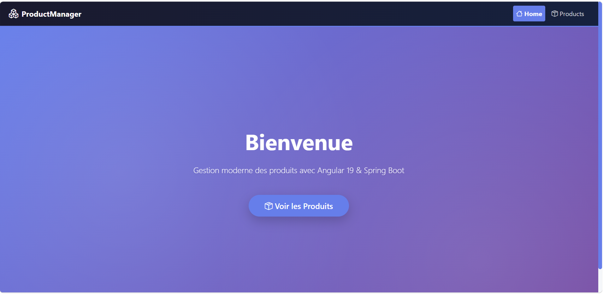
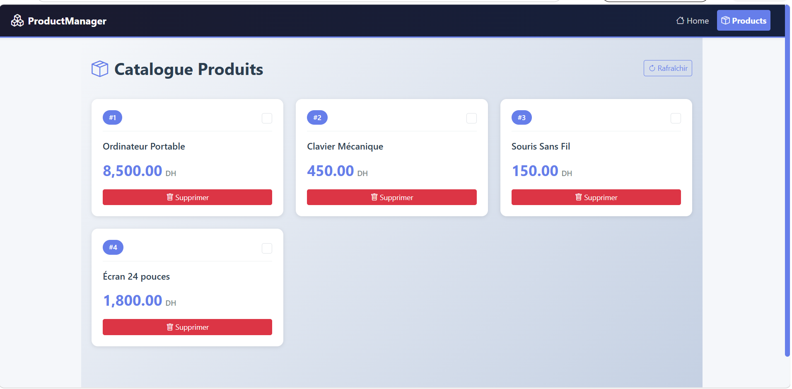
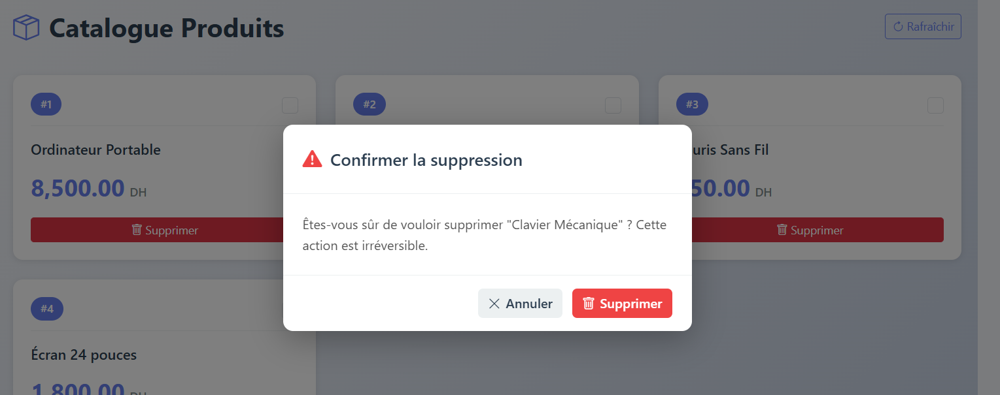

# 🎨 ProductManager Frontend

Application frontend moderne développée avec **Angular 19** pour la gestion des produits avec une expérience utilisateur optimale.

## 📋 Table des matières

- [Aperçu](#aperçu)
- [Prérequis](#prérequis)
- [Installation](#installation)
- [Démarrage](#démarrage)
- [Structure du projet](#structure-du-projet)
- [Fonctionnalités](#fonctionnalités)
- [Architecture](#architecture)
- [Composants](#composants)
- [Services](#services)
- [Styles](#styles)
- [Dépendances](#dépendances)
- [Commandes](#commandes)
- [Configuration API](#configuration-api)
- [Troubleshooting](#troubleshooting)

## 🎯 Aperçu

**ProductManager** est une application web moderne pour gérer une liste de produits avec les fonctionnalités suivantes:

- 📦 Affichage des produits en grid moderne avec animations
- ☑️ Sélection/désélection des produits
- 🗑️ Suppression avec modal de confirmation personnalisé
- 🎨 Interface moderne avec design system cohérent
- 📱 Design entièrement responsive (mobile, tablette, desktop)
- ⚡ Navigation fluide avec routing Angular
- 🌈 Animations smooth et transitions
- ♿ Accessibilité (ARIA labels, sémantique HTML)

## 📦 Prérequis

- **Node.js** >= 18.x
- **npm** >= 9.x (ou **yarn** >= 1.22.x)
- **Backend API** en cours d'exécution sur `http://localhost:8080`

## 🚀 Installation

### 1. Accéder au dossier frontend

```bash
cd "Activite Pratique N°4/frontend"
```

### 2. Installer les dépendances

```bash
npm install
```

Ou avec yarn:

```bash
yarn install
```

### 3. Vérifier la configuration de l'API

L'URL de base de l'API est définie dans `src/app/services/product.service.ts`:

```typescript
private apiUrl = 'http://localhost:8080/api/products';
```

Assurez-vous que le backend Spring Boot est accessible sur cette adresse.

## 🏃 Démarrage

### Mode développement (avec rechargement automatique)

```bash
npm start
```

Ou avec Angular CLI:

```bash
ng serve
```

L'application sera disponible sur **http://localhost:4200**

### Mode production

```bash
npm run build
```

Les fichiers compilés seront générés dans le dossier `dist/`.

### Servir la version production localement

```bash
npm run preview
```

## 📁 Structure du projet

```
frontend/
├── src/
│   ├── app/
│   │   ├── components/
│   │   │   └── confirm-modal/                    # Modal de confirmation
│   │   │       ├── confirm-modal.component.ts    # Logique modal
│   │   │       ├── confirm-modal.component.html  # Template
│   │   │       └── confirm-modal.component.css   # Styles
│   │   │
│   │   ├── pages/
│   │   │   ├── home/                             # Page d'accueil
│   │   │   │   ├── home.component.ts
│   │   │   │   ├── home.component.html
│   │   │   │   └── home.component.css
│   │   │   │
│   │   │   └── products/                         # Page produits
│   │   │       ├── products.component.ts
│   │   │       ├── products.component.html
│   │   │       └── products.component.css
│   │   │
│   │   ├── models/
│   │   │   └── product.model.ts                  # Interface Product
│   │   │
│   │   ├── services/
│   │   │   └── product.service.ts                # Service API
│   │   │
│   │   ├── app.component.ts                      # Composant racine
│   │   ├── app.component.html                    # Navbar + Router
│   │   ├── app.routes.ts                         # Configuration routing
│   │   └── app.config.ts                         # Configuration globale
│   │
│   ├── styles.css                                # Styles globaux
│   ├── main.ts                                   # Point d'entrée
│   └── index.html                                # HTML principal
│
├── angular.json                                  # Config Angular CLI
├── package.json                                  # Dépendances NPM
├── tsconfig.json                                 # Config TypeScript
├── README.md                                     # Ce fichier
└── public/
    └── favicon.ico                               # Icône

```

## 📸 Aperçu

### Page d'Accueil (Hero)


*Landing page moderne avec gradient violet, title "Bienvenue", description et CTA "Voir les Produits"*

### Page Produits


*Vue du catalogue avec design moderne en cards, grid responsive, pricing en DH, et actions disponibles*

### Modal de Confirmation de Suppression


*Modal personnalisé avec icône d'alerte, message explicite, et deux actions (Annuler / Supprimer)*

## ✨ Fonctionnalités

### 🏠 Page d'Accueil (Home)

Une landing page attractive avec:

- **Hero section** avec gradient violet → mauve
- **Bouton CTA** pour accéder aux produits
- **Animations fluides** (fade-in du contenu)
- **Background decoratif** avec effets radial
- **Design full-screen** responsive
- **Typography** moderne et lisible

**Accès**: `/`

### 📦 Page Produits (Products)

#### Affichage

- **Grid layout responsif** (auto-fill minmax 300px)
- **Product Cards** avec animations hover
- **Badge de sélection** avec icône checkmark
- **État vide** avec message explicite
- **Formatage du prix** en français (DH)

#### Interactions

- ☑️ **Checkbox** pour sélectionner/désélectionner un produit
- 🗑️ **Bouton Supprimer** qui ouvre un modal
- 🔄 **Bouton Rafraîchir** pour recharger la liste
- **Affichage du statut** en temps réel

#### Modal de Confirmation

- ✅ **Design personnalisé** (pas du confirm() natif)
- 🎯 **Overlay semi-transparent** (fermeture possible au clic)
- 📱 **Animations smooth** (slideUp + fadeIn)
- ⚠️ **Icône d'alerte** rouge
- 💬 **Message personnalisé** avec nom du produit
- 🔘 **Deux boutons** (Annuler / Supprimer)
- ♿ **Accessibilité** complète

**Accès**: `/products`

### 🎨 Navbar (Toutes les pages)

- **Branding** "ProductManager" avec icône
- **Navigation** Home et Products
- **Liens actifs** avec background highlighting
- **Gradient background** moderne (dark blue → dark teal)
- **Icons Bootstrap** pour chaque section
- **Responsive** (flexbox adaptatif)

## 🏗️ Architecture

### Hiérarchie des composants

```
AppComponent (Racine)
│
├── Navbar (intégrée dans app.component.html)
│   └── Navigation vers Home/Products
│
└── RouterOutlet
    │
    ├── HomeComponent (route: /)
    │   └── Hero Section
    │
    └── ProductsComponent (route: /products)
        ├── Header avec titre et bouton Rafraîchir
        ├── Products Grid
        │   └── Product Card[] (ngFor)
        │       └── Checkbox + Infos + Bouton Supprimer
        │
        └── ConfirmModalComponent (Child)
            └── Modal Overlay + Boutons
```

### Services

#### ProductService

Gère toutes les communications avec l'API backend.

```typescript
// Récupère tous les produits
getProducts(): Observable<Product[]>

// Met à jour le statut de sélection d'un produit
updateSelected(id: number, selected: boolean): Observable<Product>

// Supprime un produit
deleteProduct(id: number): Observable<void>
```

**Utilisation d'HTTP Client** avec observables RxJS pour l'asynchrone.

### Routing

Configuration dans `app.routes.ts`:

```typescript
[
  {
    path: '',
    component: HomeComponent
  },
  {
    path: 'products',
    component: ProductsComponent
  }
]
```

**Navigation**:
- `/` → Home (hero page)
- `/products` → Liste des produits

## 🎨 Styles & Design

### Palette de couleurs

```css
--primary-color: #667eea      /* Violet/Bleu */
--secondary-color: #764ba2    /* Mauve/Rose */
--success-color: #10b981      /* Vert (sélection) */
--danger-color: #ef4444       /* Rouge (suppression) */
--bg-light: #f5f7fa           /* Fond clair */
--text-dark: #2c3e50          /* Texte sombre */
--text-muted: #7f8c8d         /* Texte gris */
```

### Typographie

- **Font Stack**: System fonts (-apple-system, Segoe UI, Roboto, etc.)
- **Headings**: Font-weight 600-700, line-height 1.2-1.4
- **Body**: Font-weight 400-500, line-height 1.5-1.6

### Breakpoints Responsifs

- **Desktop** (> 1200px): Grid 3-4 colonnes
- **Tablette** (768px - 1200px): Grid 2 colonnes
- **Mobile** (< 768px): Grid 1 colonne full-width
- **Mobile petit** (< 480px): Padding/margin révisé

### Animations

- **Fade-in**: Apparition progressive
- **Slide-up**: Entrée depuis le bas
- **Hover effects**: Élévation des cards (translateY)
- **Scale**: Léger zoom au survol
- **Transitions**: 0.2s - 0.3s ease

## 📚 Dépendances

### Production

```json
{
  "@angular/animations": "^19.0.0",
  "@angular/common": "^19.0.0",
  "@angular/core": "^19.0.0",
  "@angular/forms": "^19.0.0",
  "@angular/platform-browser": "^19.0.0",
  "@angular/platform-browser-dynamic": "^19.0.0",
  "@angular/router": "^19.0.0",
  "bootstrap": "^5.3.3",
  "bootstrap-icons": "^1.11.3",
  "rxjs": "^7.8.2",
  "tslib": "^2.8.1",
  "zone.js": "^0.15.1"
}
```

### Développement

```json
{
  "@angular-devkit/build-angular": "^19.0.0",
  "@angular/cli": "^19.0.0",
  "@angular/compiler-cli": "^19.0.0",
  "@types/node": "^20.0.0",
  "typescript": "~5.6.2"
}
```

## 🛠️ Commandes

### Développement

```bash
# Démarrer le serveur de dev avec reload automatique
npm start
ng serve

# Démarrer sur un port spécifique
ng serve --port 4300
```

### Build

```bash
# Construire pour la production (optimisé)
npm run build
ng build --configuration production

# Construire pour dev
ng build
```

### Tests

```bash
# Lancer les tests unitaires
npm test
ng test

# Lancer les tests avec couverture de code
ng test --code-coverage
```

### Linting

```bash
# Analyser le code
npm run lint
ng lint
```

### Preview

```bash
# Servir la version production localement
npm run preview
```

### Aide

```bash
# Afficher toutes les commandes disponibles
ng help
```

## 🔌 Configuration API

### Backend URL

L'application s'attend à trouver le backend sur:

```
http://localhost:8080/api/products
```

### Modifier l'URL de l'API

Éditer `src/app/services/product.service.ts`:

```typescript
private apiUrl = 'http://votre-domaine.com/api/products';
```

### Environnements

Créer des fichiers d'environnement pour différents configs:

**`src/environments/environment.ts`** (développement)
```typescript
export const environment = {
  production: false,
  apiUrl: 'http://localhost:8080'
};
```

**`src/environments/environment.prod.ts`** (production)
```typescript
export const environment = {
  production: true,
  apiUrl: 'https://api.example.com'
};
```

Puis dans le service:
```typescript
import { environment } from '../../environments/environment';

private apiUrl = `${environment.apiUrl}/api/products`;
```

## 🐛 Troubleshooting

### ❌ CORS Error (Access-Control-Allow-Origin)

**Symptôme**: Erreur de cross-origin dans la console

**Solution**: Ajouter `@CrossOrigin` au backend Spring Boot:

```java
@CrossOrigin(origins = "http://localhost:4200")
@RestController
@RequestMapping("/api/products")
public class ProductController { ... }
```

### ❌ Page blanche / Application ne charge pas

**Symptôme**: Affichage vide

**Étapes**:
1. Vérifier Node.js: `node --version`
2. Vérifier npm: `npm --version`
3. Réinstaller dépendances:
   ```bash
   rm -rf node_modules
   npm install
   ```
4. Redémarrer le serveur: `npm start`
5. Vérifier la console (F12 > Console)

### ❌ Backend non accessible (404)

**Symptôme**: Les produits ne se chargent pas / Erreur 404

**Étapes**:
1. Vérifier que le backend est démarré: `http://localhost:8080`
2. Vérifier l'URL de l'API dans `product.service.ts`
3. Tester l'API directement: `curl http://localhost:8080/api/products`
4. Vérifier les logs du backend

### ❌ Les styles ne s'appliquent pas

**Symptôme**: Page sans CSS / Design cassé

**Étapes**:
1. Vérifier Bootstrap est installé: `npm list bootstrap`
2. Redémarrer le serveur: `npm start`
3. Vider le cache du navigateur: Ctrl+Shift+Delete
4. Vérifier l'import Bootstrap dans `angular.json`:
   ```json
   "styles": [
     "node_modules/bootstrap/dist/css/bootstrap.min.css",
     "node_modules/bootstrap-icons/font/bootstrap-icons.css",
     "src/styles.css"
   ]
   ```

### ❌ Erreur TypeScript

**Symptôme**: Erreurs de compilation

**Solution**:
1. Vérifier TypeScript: `npx tsc --version`
2. Rebuilder: `ng build`
3. Réinstaller dépendances: `npm install`

## 📖 Ressources

- [Angular Documentation](https://angular.io/docs)
- [Angular API Reference](https://angular.io/api)
- [Bootstrap 5 Docs](https://getbootstrap.com/docs/)
- [Bootstrap Icons](https://icons.getbootstrap.com/)
- [RxJS Documentation](https://rxjs.dev/)
- [TypeScript Handbook](https://www.typescriptlang.org/docs/)
- [HTTP Client Guide](https://angular.io/guide/http)

## 📝 Notes de développement

### Best Practices appliquées

✅ **Standalone Components** - Architecture moderne d'Angular
✅ **Strong Typing** - TypeScript avec interfaces
✅ **Reactive Programming** - RxJS Observables
✅ **Component Reusability** - Modal modal réutilisable
✅ **Responsive Design** - Mobile-first approach
✅ **Accessibility** - ARIA labels et sémantique HTML5
✅ **Clean Code** - Code lisible, maintenable, documenté
✅ **Error Handling** - Gestion gracieuse des erreurs

### Améliorations futures

- [ ] Pagination des produits
- [ ] Barre de recherche/filtrage
- [ ] Tri des colonnes
- [ ] Toast notifications pour les actions
- [ ] Tests unitaires (Karma + Jasmine)
- [ ] Tests e2e (Cypress/Playwright)
- [ ] Lazy loading des images
- [ ] Service worker (PWA)
- [ ] Dark mode
- [ ] Édition des produits (ajouter/modifier)
- [ ] Exportation CSV/PDF
- [ ] Statistiques/dashboard

## 👨‍💻 Information

**Version Angular**: 19.x
**Dernière mise à jour**: Juillet 2026
**Statut**: Production-ready

---

Pour toute question ou problème, consultez la section [Troubleshooting](#troubleshooting) ou la documentation officielle d'Angular.

